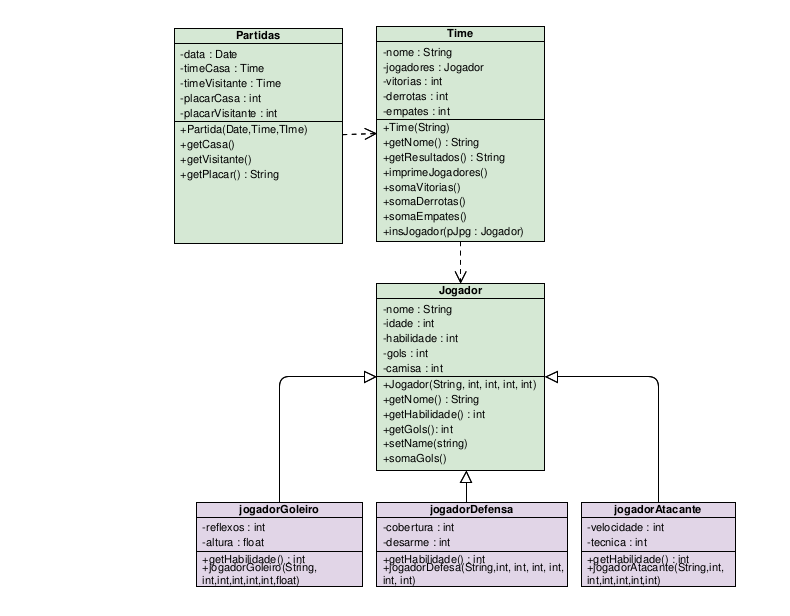

# Projeto_Football-League

Projeto desenvolvido por mim, [Alliquison Matias](https://github.com/Ally-Matias), [João Paulo](https://github.com/joaopaulonr) e [Antonio Avelino](https://github.com/avelinofaco).
##

Projeto idealizado para a implementação de uma estrutura de classes que permita armazenar e manipular dados de jogadores,times e jogos. Essa estrutura será utilizada para montar um protótipo de jogo de simulação estilo
“Football Manager”, no qual a pessoa que está jogando assume o papel de um técnico, escalando o time e um software simula os jogos entre times.

Existem vários jogos derivados do “Football Manager” como o Elifoot, Brasfoot e Championship Manager. Todos com o mesmo estilo.

Nessa parte 1 nos preocupamos APENAS com a implementação orientada a objetos que envolve cada entidade do problema. que inclui as classes (que devem ser obrigatoriamente em quantidade e nome iguais ao do diagrama), bem como seus atributos e métodos. Repare que o diagrama indica a relação entre as classes, entre as quais temos herança (é-um) e uso (dependência).
Após implementar as classes criamos um programa principal main() que instancie dois objetos “Time” contendo cinco objetos “Jogador” cada (entre os quais: um goleiro, dois defensores e dois atacantes), e também um objeto “Partida” que será composto de dois times.

##

## Diagrama UML

